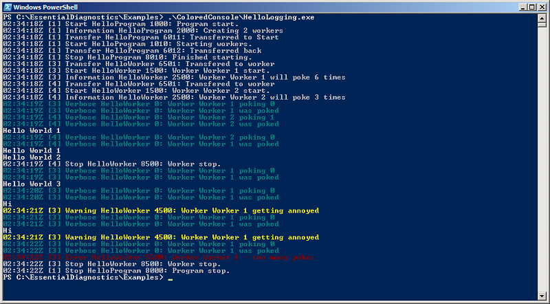

# ColoredConsoleTraceListener Class

Trace listener that outputs to the console in color, optionally using a custom formatting template. 

## Installing

Install via NuGet:

* PM> **Install-Package [Essential.Diagnostics.ColoredConsoleTraceListener](http://www.nuget.org/packages/Essential.Diagnostics.ColoredConsoleTraceListener)**

## Remarks

The initializeData for the ColoredConsoleTraceListener should contain a boolean (true/false) value indicating whether to use the Console.Error stream. The default is false, that is to use the normal Console.Out stream. 

Note that colored output is only used in the normal stream; it is not used in the error stream. 
        
The event and context information can be formatted using a custom format string containing argument tokens in curly braces. Standard .NET formatting can be applied to these values, e.g. "{DateTime:yyyy-MM-dd}" outputs the year, month and day. For more information on the template tokens available, [TraceFormatter](TraceFormatter). 

The following parameters are available in the template string: Data, Data0, EventType, Id, Message, ActivityId, RelatedActivityId, Source, Callstack, DateTime (or UtcDateTime), LocalDateTime, LogicalOperationStack, ProcessId, ThreadId, Timestamp, MachineName, ProcessName, ThreadName, ApplicationName.

The default format is "{Source} {EventType}: {Id} : {Message}", and default colors used are Red for Critical, DarkRed for Error, Yellow for Warning, DarkCyan for Verbose, and Gray for all other messages.

## Config Attributes

|| Attribute || Description ||
| initializeData | false (default) to use the Console.Out stream; true to use Console.Error. |
| traceOutputOptions | Are written on separate lines after each trace output in a fixed format; largely redundant as the template can be used to format as desired. |
| convertWriteToEvent | If false (default), then calls to Write(String, String, Object),WriteLine(String, String, Object) and similar methods are output directly to the output stream (using the Verbose color). If true, then calls to these methods are instead converted to Verbose trace events and then output using the same format as calls to Trace methods. |
| template | Template to use to format trace messages. The default format is "{Source} {EventType}: {Id} : {Message}". For more information on the template tokens available, [TraceFormatter](TraceFormatter). |
| ...Color | Color to use for the specified type of event. Valid console color values are: Black, DarkBlue, DarkGreen, DarkCyan, DarkRed, DarkMagenta, DarkYellow, Gray, DarkGray, Blue, Green, Cyan, Red, Magenta, Yellow, White. |

activityTracingColor applies to all activity tracing events unless overridden by for a specific event type, e.g. transferColor.

**Note:** When selecting colors note that PowerShell redefines DarkYellow and DarkMagenta and uses them as default colors, so best to to avoid those two colors because result is not consistent.

## Example Config

{code:xml}
<?xml version="1.0" encoding="utf-8" ?>
<configuration>
  <system.diagnostics>
    <sharedListeners>
      <add name="coloredconsole"
        type="Essential.Diagnostics.ColoredConsoleTraceListener, Essential.Diagnostics.ColoredConsoleTraceListener"
        template="{DateTime:HH':'mm':'ssZ} [{Thread}]({Thread}) {EventType} {Source} {Id}: {Message}{Data}"
        convertWriteToEvent="true" />
    </sharedListeners>
    <sources>
      <source name="ExampleSource" switchValue="All">
        <listeners>
          <clear />
          <add name="coloredconsole" />
        </listeners>
      </source>
    </sources>
  </system.diagnostics>
</configuration>
{code:xml}

## Example Output

The trace listener writes to the standard console, or PowerShell, with colored messages:

## Config Template

{code:xml}
<add name="coloredconsole"
  type="Essential.Diagnostics.ColoredConsoleTraceListener, Essential.Diagnostics.ColoredConsoleTraceListener"
  initalizeData="false|true"
  traceOutputOptions="ProcessId,LogicalOperationStack,ThreadId,DateTime,Timestamp,Callstack"
  activityTracingColor="Gray|other console color"
  convertWriteToEvent="false|true"
  criticalColor="Red|other console color"
  errorColor="DarkRed|other console color"
  informationColor="Gray|other console color"
  resumeColor="console color"
  startColor="console color"
  stopColor="console color"
  suspendColor="console color"
  template="format template"
  transferColor="console color" 
  verboseColor="DarkCyan|other console color"
  warningColor="Yellow|other console color" 
/>
{code:xml}
