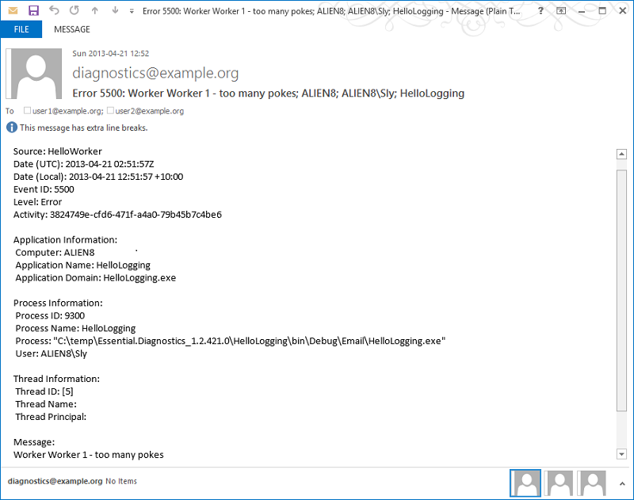

# EmailTraceListener Class

Sends a formatted email containing the contents of the trace.

## Remarks

Sends each trace message received in an email, using the specified subject and body templates.

It is strongly recommended to set a filter to only accept Warning and above errors, or otherwise reduce the number of trace events that are processed by this listener to avoid flooding.

Sending an email is an expensive operation, so messages are queued and sent on a separate thread. If there is a flood of messages exceeding the queue size then messages will be dropped.

The SMTP host settings are defined in MailSettings of app.config, as documented at http://msdn.microsoft.com/en-us/library/w355a94k.aspx.  

Each message is sent in an asynchronous call. When the host process exits gracefully, all mail messages left in queue will be sent out, within a grace period of up to 2 seconds.

## Config Attributes

|| Attribute || Description ||
| initializeData | Email address of the recipient. Multiple recipients may be separated by commas, for example "user1@example.org,userB@example.com". |
| traceOutputOptions | Ignored. |
| bodyTemplate | Template used to construct the email body. |
| fromAddress | Optional alternate from address, instead of the one configured in system.net mailSettings. |
| maxConnections | Maximum concurrent SMTP connections. Default is 2 connections. |
| maxTracesPerHour | Maximum number of emails per hour that will be sent, to prevent flooding. Default is 50. Use 0 for unlimited (not recommended). |
| subjectTemplate | Template used to construct the email subject. |

The default subject template is "{EventType} {Id}: {MessagePrefix}; {MachineName}; {User}; {ProcessName}".

The default body template includes the source, date (UTC and local), event ID, level, activity correlation identifier, application information (machine name, application name, application domain), process information (process ID, name, user), thread information (thread ID, name, principal), and the formatted trace message and data.

For more information on the template tokens available in bodyTemplate and subjectTemplate, see [TraceFormatter](TraceFormatter).

## Example Config

{code:xml}
<?xml version="1.0" encoding="utf-8" ?>
<configuration>
  <system.diagnostics>
    <sharedListeners>
      <add name="email"
        type="Essential.Diagnostics.EmailTraceListener, Essential.Diagnostics"
        initializeData="user1@example.org,user2@example.org">
        <filter type="System.Diagnostics.EventTypeFilter"
                initializeData="Warning" />
      </add>
    </sharedListeners>
    <sources>
      <source name="ExampleSource" switchValue="All">
        <listeners>
          <clear />
          <add name="email" />
        </listeners>
      </source>
    </sources>
  </system.diagnostics>
  <system.net>
    <mailSettings>
      <smtp deliveryMethod="SpecifiedPickupDirectory" from="diagnostics@example.org">
        <specifiedPickupDirectory pickupDirectoryLocation="C:\Temp\MailPickup" />
      </smtp>
    </mailSettings>
  </system.net>
</configuration>
{code:xml}

**Note:** The above example sends emails to a local pickup directory. To use an SMTP server change the mail settings to use deliveryMethod="Network" and enter your SMTP server name. If testing with a tool such as smtp4dev, use host="localhost".

{code:xml}
    <mailSettings>
      <smtp deliveryMethod="Network" from="[application-name](application-name)@example.org">
        <network host="[smtp-server-name](smtp-server-name)" defaultCredentials="true" />
      </smtp>
    </mailSettings>
{code:xml}

## Example Output

Email message, showing templated subject and body with details of a single event.

## Config Template

{code:xml}
<add name="email"
  type="Essential.Diagnostics.EmailTraceListener, Essential.Diagnostics"
  initalizeData=""
  bodyTemplate="Source: {Source}
Date (UTC): {DateTime:u}
Date (Local): {LocalDateTime:yyyy'-'MM'-'dd HH':'mm':'ss zzz}
Event ID: {Id}
Level: {EventType}
Activity: {ActivityId}

Application Information:
 Computer: {MachineName}
 Application Name: {ApplicationName}
 Application Domain: {AppDomain}

Process Information:
 Process ID: {ProcessId}
 Process Name: {ProcessName}
 Process: {Process}
 User: {User}

Thread Information:
 Thread ID: [{ThreadId}]({ThreadId})
 Thread Name: {ThreadName}
 Thread Principal: {PrincipalName}

Message:
{Message}

Data:
{Data}"
  fromAddress=""
  maxConnections="2"
  maxTracesPerHour="50"
  subjectTemplate="{EventType} {Id}: {MessagePrefix}; {MachineName}; {User}; {ProcessName}"
  >
  <filter type="System.Diagnostics.EventTypeFilter" initializeData="Warning" />
</add>
{code:xml}

## Notes

Because of the latency of email, performance and the limitation of email relay, a critical error in a service app might trigger tens of thousands of warning/error trace messages. The listener queues emails and sends them using a separate thread, to minimise impact on the main application, however due to the delays in sending if several messages queue up the application may end before it can finish sending all queued messages; in this case any queued messages are lost (although the listener does try and finish sending any remaining messages before the application exits).

The listener also includes flood protection and, for a single process, will send a maximum of 50 (default) messages per hour. Any excess messages are simply discarded, so you need to be aware if there is a flood of trace messages to email that not all will be reported.

To limit issues, you should add a filter to the listener, as in the examples above.

You can also change the flood protection limit via configuration, or even disable it and send unlimited messages through setting maxTracesPerHour="0". If you do this, be aware that the message queue could then fill up memory (possibly causing the application to crash).

To limit this you could delivery messages to a local pickup directory, which may be quicker. A separate application can then pickup and send messages, even after the host process is terminated.

Firewall, anti-virus software and the mail server spam policy may also have impact on this listener, so system administrators have to be involved to ensure the smooth operation of this listener.

If you define deliveryMethod as SpecifiedPickupDirectory to write messages to a pickup directory, please make sure the total number of client connections is no more than 2, because concurrent access to a file system on hard drives is almost certain to slow down the overall performance unless you have RAID.

For the best performance, you need to run some integration tests to get the optimized number of maxConnections for a RAID system or a SMTP system. Essential Diagnostics includes a NUnit test project called Essential.Diagnostics.IntegrationTests for such purpose. To carry out such tests:

# Install NUnit on the host machine.
# Copy the test assembly along with its dependencies to the host machine.
# Modify the app config file accordingly.
# Run tests, and in particular with test case TestMailMessageQueueWithManyMessages.
   
Please note, defining a large number of SMTP connections in pool may not necessarily give you the best performance. The overall performance with the optimized number of concurrent connections depends on the following factors:

# The number of processors
# The implementation/config of the SMTP server
# The average size of email messages
# The type of hard drives
