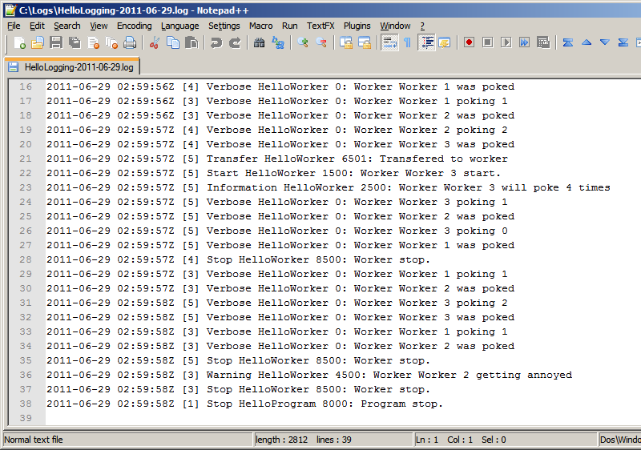

# RollingFileTraceListener Class

Trace listener that writes to a text file, rolling to a new file based on a filename template (usually including the date).

## Installing

Install via NuGet:

* PM> **Install-Package [Essential.Diagnostics.RollingFileTraceListener](http://www.nuget.org/packages/Essential.Diagnostics.RollingFileTraceListener)**

## Remarks

A rolling log file is achieved by including the date in the filename, so that when the date changes a different file is used.

Available tokens include DateTime (a UTC DateTimeOffset) and LocalDateTime (a local DateTimeOffset), as well as several static values detailed below. These use standard .NET format strings, e.g. "Trace{DateTime:yyyyMMddTHH}.log" would generate a different log name each hour.

The default filePathTemplate is "{ApplicationName}-{DateTime:yyyy-MM-dd}.log", which matches the format used by Microsoft.VisualBasic.Logging.FileLogTraceListener (except that it uses UTC time instead of local time).

Log messages can be formatted by using the template property. The available arguments are detailed in [TraceFormatter](TraceFormatter).
	
## Config Attributes

|| Attribute || Description ||
| initializeData | Template file path and name to log to, using replacement tokens to rotate based on the date; the default template is "{ApplicationName}-{DateTime:yyyy-MM-dd}.log", which rotates on a daily basis. |
| traceOutputOptions | Not used. |
| convertWriteToEvent | If true (default), then calls to Write(String, String, Object), WriteLine(String, String, Object) and similar methods are converted to Verbose trace events and then output using the same format as calls to Trace methods. If false, then calls to these methods are output directly to the output file.  |
| template | Template to use to format trace messages. The default format is {""{DateTime:u} [{Thread}]({Thread}) {EventType} {Source} {Id}: {Message}{Data}""}. For more information on the template tokens available see [TraceFormatter](TraceFormatter). |

## Path Template Parameters

|| Parameter || Description ||
| {AppData} | Resolves the mapped path equivalent to "~/App_Data", for the current HttpContext. |
| {ApplicationName} | Name of the current executable, without the extension. |
| {DateTime} | DateTimeOffset of the log event, in the UTC (+0) timezone. |
| {LocalDateTime} | DateTimeOffset of the log event, in the local timezone. |
| {MachineName} | Local computer name, from Environment.MachineName. |
| {ProcessId} | Id of the current process, from Process.GetCurrentProcess(). |
| {ProcessName} | Name of the current process, from Process.GetCurrentProcess(). |

## Example Config

{code:xml}
<?xml version="1.0" encoding="utf-8" ?>
<configuration>
  <system.diagnostics>
    <sharedListeners>
      <add name="rollingfile"
        type="Essential.Diagnostics.RollingFileTraceListener, Essential.Diagnostics.RollingFileTraceListener"
        initializeData="{ApplicationName}-{DateTime:yyyy-MM-dd}.log" />
    </sharedListeners>
    <sources>
      <source name="ExampleSource" switchValue="All">
        <listeners>
          <clear />
          <add name="rollingfile" />
        </listeners>
      </source>
    </sources>
  </system.diagnostics>
</configuration>
{code:xml}

## Example Output

Example log file messages, open in a text editor:

## Config Template

{code:xml}
<add name="rollingfile"
  type="Essential.Diagnostics.RollingFileTraceListener, Essential.Diagnostics.RollingFileTraceListener"
  initializeData="{ApplicationName}-{DateTime:yyyy-MM-dd}.log"
  convertWriteToEvent="true|false" 
  template="{DateTime:u} [{Thread}]({Thread}) {EventType} {Source} {Id}: {Message}{Data}"
/>
{code:xml}
