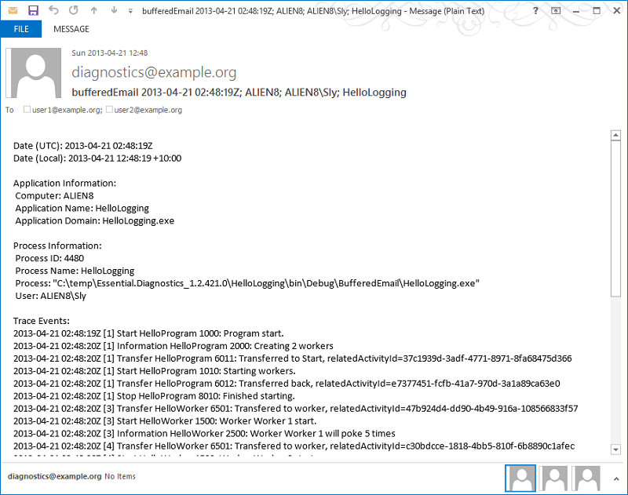

# BufferedEmailTraceListener Class

Adds formatted trace messages to a buffer and sends an email when the process exits, or on request.

## Remarks

The initializeData for the listener should contain a to Email address, which is mandatory. And you may define multiple addresses separated by comma in initialzeData. 

Intended to be used in console apps which will send all warning/error traces via one Email message at the end of the hosting process. If there’s no trace, this listener will not send anything.

Calling `BufferedEmailTraceListener.SendAll()` will send accumulated messages for all listeners attached to the default Trace before the end of the host process, for example, you might want to send one message at the end of each loop. Using TraceSource you need need to check the listener collection and call `listener.Send()` for the same effect.
	
## Config Attributes

| Attribute | Description |
| --------- | ----------- |
| initializeData | Email address of the recipient. Multiple recipients may be separated by commas, for example "user1@example.org,userB@example.com". |
| traceOutputOptions | Ignored. |
| fromAddress | Optional alternate from address, instead of the one configured in system.net mailSettings. |
| headerTemplate | Template used to construct the header of the email body. |
| maxConnections | Maximum concurrent SMTP connections. Default is 2 connections. |
| subjectTemplate | Template used to construct the email subject. |
| traceTemplate | Template for a single trace message. |

The default subject template is "{Listener} {DateTime:u}; {MachineName}; {User}; {ProcessName}". It is based on the contents of the first trace received by the listener, so usually it is best to use information that is constant across all traces.

The email body consists of the header template, followed by a line break, followed by lines for all accumulated individual trace templates. The header is based on the contents of the first trace received and the default header template includes the date (UTC and local), application information (machine name, application name, application domain), and process information (process ID, name, user).

The default template for individual traces is "{DateTime:u} [{Thread}]({Thread}) {EventType} {Source} {Id}: {Message}{Data}".

For more information on the template tokens available in headerTemplate subjectTemplate and traceTemplate, see [TraceFormatter](TraceFormatter.md).

## Example Config

```xml
<?xml version="1.0" encoding="utf-8" ?>
<configuration>
  <system.diagnostics>
    <sharedListeners>
      <add name="bufferedEmail"
        type="Essential.Diagnostics.BufferedEmailTraceListener, Essential.Diagnostics"
        initializeData="user1@example.org,user2@example.com">
      </add>
    </sharedListeners>
    <sources>
      <source name="ExampleSource" switchValue="All">
        <listeners>
          <clear />
          <add name="bufferedEmail" />
        </listeners>
      </source>
    </sources>
  </system.diagnostics>
  <system.net>
    <mailSettings>
      <smtp deliveryMethod="SpecifiedPickupDirectory" from="diagnostics@example.org">
        <specifiedPickupDirectory pickupDirectoryLocation="C:\Temp\MailPickup" />
      </smtp>
    </mailSettings>
  </system.net>
</configuration>
```

**Note:** The above example sends emails to a local pickup directory. To use an SMTP server change the mail settings to use deliveryMethod="Network" and enter your SMTP server name. If testing with a tool such as smtp4dev, use host="localhost".

```xml
    <mailSettings>
      <smtp deliveryMethod="Network" from="[application-name](application-name)@example.org">
        <network host="[smtp-server-name](smtp-server-name)" defaultCredentials="true" />
      </smtp>
    </mailSettings>
```

## Example Output

Email message, showing templated subject and body header with details of the first event, followed by lines containing all of the events that were logged.



## Config Template

```xml
<add name="bufferedEmail"
  type="Essential.Diagnostics.BufferedEmailTraceListener, Essential.Diagnostics"
  initalizeData=""
  fromAddress=""
  headerTemplate="Date (UTC): {DateTime:u}
Date (Local): {LocalDateTime:yyyy'-'MM'-'dd HH':'mm':'ss zzz}

Application Information:
 Computer: {MachineName}
 Application Name: {ApplicationName}
 Application Domain: {AppDomain}

Process Information:
 Process ID: {ProcessId}
 Process Name: {ProcessName}
 Process: {Process}
 User: {User}

Trace Events:"
  maxConnections="2"
  traceTemplate="{DateTime:u} [{Thread}]({Thread}) {EventType} {Source} {Id}: {Message}{Data}"
  subjectTemplate="{Listener} {DateTime:u}; {MachineName}; {User}; {ProcessName}"
  />
```
