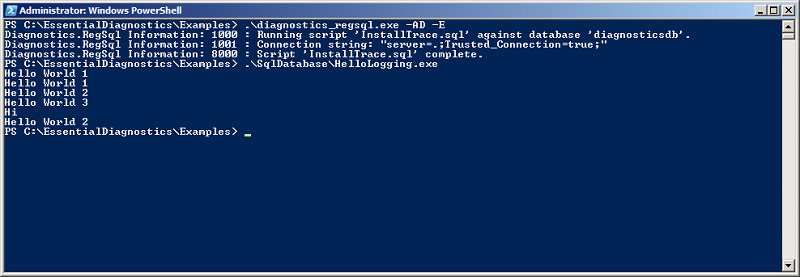
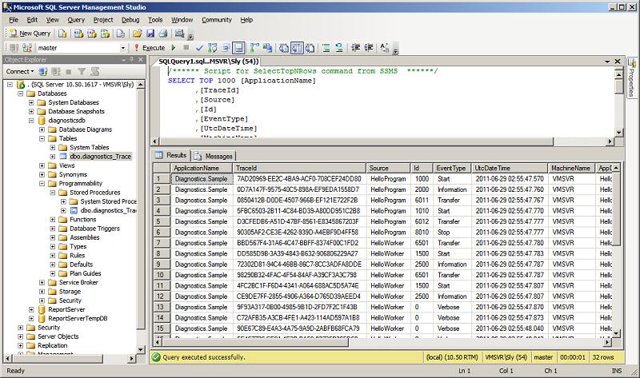

# SqlDatabaseTraceListener Class

Trace listener that writes to a database. 

## Installing

Install via NuGet:

* PM> **Install-Package [Essential.Diagnostics.SqlDatabaseTraceListener](http://www.nuget.org/packages/Essential.Diagnostics.SqlDatabaseTraceListener)**

## Remarks

This listener writes to the database table created by the diagnostics_regsql tool (included in the NuGet package), via the stored procedure created by the tool.  You can run the tool to automatically create the table and stored procedure for you.

Alternatively you can supply your own command text, which can use the following SQL parameters: @ApplicationName, @Source, @Id, @EventType, @UtcDateTime, @MachineName, @AppDomainFriendlyName, @ProcessId, @ThreadName, @Message, @ActivityId, @RelatedActivityId, @LogicalOperationStack, @Data. 

If you supply your own command then you need to create any tables and stored procedures yourself.

## Config Attributes

| Attribute | Description |
| --------- | ----------- |
| initializeData | Name of the connection string of the database to write to. |
| traceOutputOptions | Not used. |
| applicationName | Application name to use when writing to the database; set this value when the database is shared between multiple applications. The default value is an empty string. |
| commandText | Command to use when calling the database. The default is the diagnostics_Trace_AddEntry stored procedure created by the diagnostics_regsql tool. |
| maxMessageLength | Maximum length of the message text to write to the database, where the database column has limited size. Messages (after inserting format parameters) are trimmed to this length, with the last three characters replaced by "..." if the original message was longer. |

## Example Config

```xml
<?xml version="1.0" encoding="utf-8" ?>
<configuration>
  <connectionStrings>
    <add name="diagnosticsdb"
      providerName="System.Data.SqlClient"
      connectionString="server=.;database=diagnosticsdb;Integrated Security=SSPI" />
  </connectionStrings>
  <system.diagnostics>
    <sharedListeners>
      <add name="sqldatabase"
        type="Essential.Diagnostics.SqlDatabaseTraceListener, Essential.Diagnostics.SqlDatabaseTraceListener"
        initializeData="diagnosticsdb"
        applicationName="Diagnostics.Sample" />
    </sharedListeners>
    <sources>
      <source name="ExampleSource" switchValue="All">
        <listeners>
          <clear />
          <add name="sqldatabase" />
        </listeners>
      </source>
    </sources>
  </system.diagnostics>
</configuration>
```

## Example Output

Use the diagnostics_regsql tool to create the diagnostics_Trace table and stored procedure:



Data is written to SQL using the specified command. 

You can query the diagnostics_Trace table to see the messages written:



## Config Template

```xml
<add name="sqldatabase"
  type="Essential.Diagnostics.SqlDatabaseTraceListener, Essential.Diagnostics.SqlDatabaseTraceListener" 
  initializeData="connection string name"
  applicationName="application name"
  commandText="SQL command"
  maxMessageLength="1500"
/>
```
