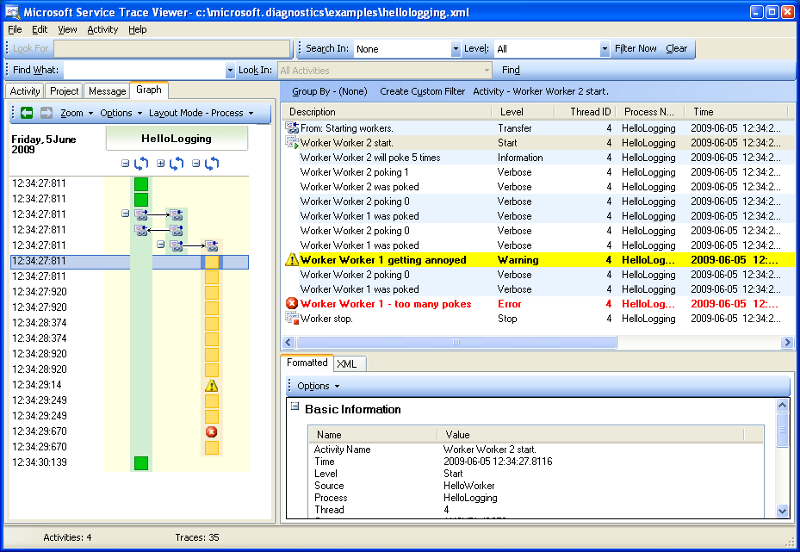

# XmlWriterTraceListener Class

Writes E2ETraceEvent XML fragments to a file, suitable for viewing using the Service Trace Viewer tool.

## Remarks

For an alternative that supports rolling E2ETraceEvent files with various creation frequency (hourly, daily, weekly), see [RollingXmlTraceListener](RollingXmlTraceListener).
	
## Config Attributes

| Attribute | Description |
| --------- | ----------- |
| initializeData | Path of the file to write to. |
| traceOutputOptions | Ignored. |

## Example Config

```xml
<?xml version="1.0" encoding="utf-8" ?>
<configuration>
  <system.diagnostics>
    <sharedListeners>
      <add name="xmlwriter"
           type="System.Diagnostics.XmlWriterTraceListener"
           initializeData="Logs\Trace.svclog" />
    </sharedListeners>
    <sources>
      <source name="ExampleSource" switchValue="All">
        <listeners>
          <clear />
          <add name="xmlwriter" />
        </listeners>
      </source>
    </sources>
  </system.diagnostics>
</configuration>
```

## Example Output

Output files from multiple processes can be opened in the Service Trace Viewer tool and correlated across boundaries:



## Config Template

```xml
<add name="xmlwriter"
  type="System.Diagnostics.XmlWriterTraceListener"
  initalizeData=""
  />
```
